# Языки программирования

## Лабораторная работа 1

### Задание 1 **(4)**
*Составьте глоссарий из определений лекции. Проверка отчета будет включать 
проверку знания определений*

- **Исполняемый файл** — файл, содержащий программу в виде набора элементарных инструкций, которая после загрузки в память может быть выполнена на определенном физическом устройстве (процессоре) под управлением опредленной операционной системы
- **Ассемблер** — язык программирования низкого уровня, в котором каждая инструкция физического устройства представлена в текстовом виде.
- **Исходный код** Программа, написанная на языке высокого уровня
- **Виртуальная машина** — это средство описания семантики языка программирования
- **Стандарт языка программирования** — документ, описывающий язык программирования максимально подробно и, по возможности, наиболее формально.
- **Транслятор** — техническое средство, осуществляющее перевод текста программы с одного языка на другой.
- **Компилятор** — Транслятор, переводящий программу в машинный коддля последующего исполнения
- **Интерпретатор** — Транслятор, читающий и исполняющий программу по одной команде
- **Псевдокомпилятор** — транслятор, переводящий программу в промежуточное представление (байт-код), который состоит из набора инструкций близких по смыслу к машинному коду.
- **Компилирующий интерпретатор** — транслятор, переводящий текст программы во внутреннем представлении непосредственно после запуска. В процессе работы программа интерпретируется уже в этом представление (Python).
- **REPL-интерпретатор** — Программное средство, работающее в цикле чтения-вычисления-печати (Read-Eval-Print Loop). Интерпретатор в режиме диалога считывает законченную конструкцию языка, транслирует ее, исполняет и выводит результат (IDLE shell Python).
- **Единица трансляции** — минимальный фрагмент программы, который может быть транслирован независимо от остального кода. Разбиение программы на единицы трансляции позволяет ускорить процесс компиляции программ. В машинный код или внутреннее представление переводятся только те единицы трансляции, в которых произошли изменения.
- **Ошибки времени выполнения** — ошибки использования виртуальной машины языка программирования, обнаруживаемые в момент их возникновения, например, деление на ноль или выход за границы массива.
- **Непредсказуемое поведение** — в результате неверного использования виртуальной машины языка программирования дальнейшее исполнение программы может приводить к непредсказуемым ошибкам. То есть ошибки проявляются позже в непредсказуемый момент в непредсказуемом виде.
- **Неопределенное поведение** — поведение программы однозначно, но не определено описанием языка. Программы с неопределенным поведением могут давать различные результаты при использовании различных трансляторов.
- **Препроцессинг** — начальный этап трансляции программы.
- **Сборка** — заключительный этап трансляции, результатом которого является исполняемый файл

### Задание 2 **(1)**
*Установите файловый менеджер* **Far Manager**. *Официальный сайт*

<https://farmanager.com/download.php?l=ru>.

*Изучите его основные возможности по работе с файлами: копирование, переименование, удаление, 
запуск, редактирование, просмотр, создание файлов и папок, использование командной строки. 
Потренеруйтесь в их использовании. Для проверки вам будет дано задание на работу с файлами
с ограничением на время выполнения. Обратите внимание, что все задания требуется выполнить 
на клавиатуре без использования мыши.*

*В отчет запишите справку по горячим клавишам Far Manager, которые вы использовали.*

- **ALT + F1** выбор диска на левой панели
- **F7** создание папки
- **SHIFT + F4** создание файла
- **F4** изменение файла
- **F6** перемещение или переименование
- **F8** удаление
- **F5** копирование
- **F3** посмотреть файл, но не менять его
- **F10** выйти из Far Manager

### Задание 3 **(1)**
*Установите компилятор* **GNU C++** в составе среды программирования **code::blocks**.

*Официальный сайт*

<https://www.codeblocks.org/downloads/binaries> 

*Обратите внимание, что вам нужна сборка, в состав которой входит* **mingw**, *например*, **codeblocks-25.03mingw-setup.exe**.

*Найдите папку с бинарными файлами, в которой хранится компилятор С++ (файл* **g++.exe**).
*Например, она может называться* **D:\Program Files (x86)\CodeBlocks\MinGW\bin**.

*Проверьте, что эта папка указана в настройках путей Windows. Пункт настроек:* 

**Изменение переменных среды текущего пользователя**. 

*В переменной* **path** *должен быть указан путь к папке с компилятором С++.*

*Используя файловый менеджер создайте папку с проектом на С++, в нем запишите программу для сложения
двух чисел, выполните ее трансляцию из командной строки, запустите и убедитесь в ее работоспособности.
При проверке эту часть задания потребуется выполнить за две минуты без использования мыши.*

*В отчет вставьте скриншот с трансляцией программы из командной строки и ее запуском и работой.*

Создадим файл main.cpp

```cpp
#include <iostream>

int main() {
    int a, b;

    std::cin >> a >> b;
    std::cout << a + b << std::endl;

    return 0;
}
```

Скомпилируем в .exe и запустим

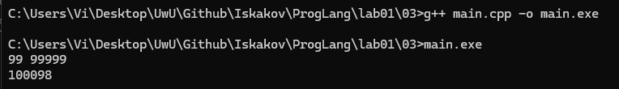

### Задание 4. **(2)**

*В этом задании необходимо записать на С++ программу, состоящую из четырех модулей. Первый модуль 
должен содержать функцию* **message(std::string)** *для вывода произвольного сообщения на консоль.*

```
#include <string>
void message(std::string mes) {
    std::cout << mes << std::endl;
}
```
*Второй модуль должен содержать функцию* **hello()** *для вывода сообщения* **hello world!!!** *и использовать
функцию* **message**.

*Третий модуль аналогично второму должен содержать должен содержать функцию* **goodbye()** *для вывода сообщения* **goodbye world!!!**.

*Четвертый модуль должен содержать функцию* **main** *и вызывать функции* **hello** *и* **goodbye**.

* Допишите заголовочные файлы.
* Создайте объектные файлы для каждой из единиц трансляции. Каждый файл надо получить отдельной командой.
* Выполните сборку программы из объектных файлов и проверьте ее работоспособность.
* Проверьте, можно ли выполнить компиляцию одного файла, если другой содержит синтаксическую ошибку.
* Проверьте, что произойдет при сборке, если один из объектных файлов будет потерян.

*В отчет вставьте скриншоты работы в командной строке и пояснения к заданиям*

*Все файлы с исходными кодами надо сохранить в папке 04*

Создадим файлы

message.cpp

```cpp
#include "message.h"
#include <iostream>
#include <string>

void message(std::string s) {
    std::cout << s << std::endl;
}
```

message.h

```h
#include <string>

void message(std::string s);
```

hello.cpp

```cpp
#include "hello.h"
#include "message.h"

void hello() {
    message("Hello World");
}
```

hello.h

```h
void hello();
```

goodbye.cpp

```cpp
#include "goodbye.h"
#include "message.h"

void goodbye() {
    message("Goodbye World");
}
```

goodbye.h

```h
void goodbye();
```

main.cpp

```cpp
#include "hello.h"
#include "goodbye.h"

int main() {
    hello();
    goodbye();

    return 0;
}
```

Компиляция в объектные файлы (.o):

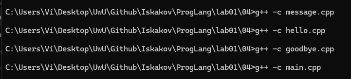

Сборка программы и проверка:

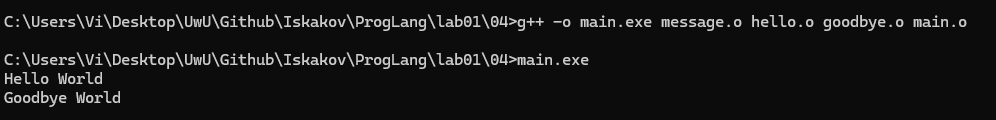

Компиляцию файла не выполнить если код в этом файле сломан

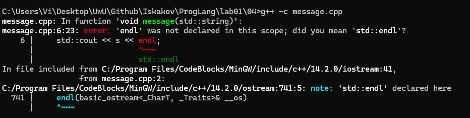

Однако компиляцию другого файла (с правильным кодом) можно выполнить, если в код в другом файле сломан

Сборка не выполнится (undefined reference to message), если один из необходимых объектных файлов потерян

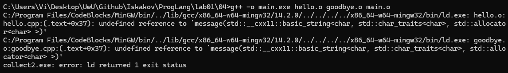

### Задание 5 **(2)**
*Выполните задание аналогичное предыдущему на языке Java. Программа должна содержать четыре класса в четырех файлах.*

Создадим файлы

Message.java

```java
public class Message {
    public static void message(String s) {
        System.out.println(s);
    }
}
```

Goodbye.java

```java
public class Goodbye {
    public static void goodbye() {
        Message.message("Goodbye World");
    }
}
```

Hello.java

```java
public class Hello {
    public static void hello() {
        Message.message("Hello World");
    }
}
```

Main.java

```java
public class Main {
    public static void main(String[] args) {
        Hello.hello();
        Goodbye.goodbye();
    }
}
```

Компиляция файлов .java


Запуск программы Java

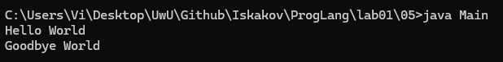

Компиляцию файла не выполнить если код в этом файле сломан

```java
public class Message {
    public static void message(String s) {
        System.out.printl(s);
    }
}
```

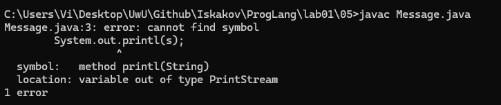

Сборка выполнится, если один из необходимых файлов потерян (Message.java), потому что Java - умный компилятор и он сам берет файлы, которые используются в программе

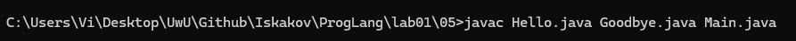

### Задание 6 **(2)**
*Выполните задание аналогичное предыдущему на языке python. Программа должна содержать четыре функции в четырех файлах.*

*Далее записаны функции в двух файлах. Инструкция* **import** *импортирует функцию из другого модуля.*

**message.py**
```
def message(mes):
   print(mes)
```
**hello.py**
```
from message import message
def hello():
   message('Hello world!!!')
```

Создадим файлы

message.py

```py
def message(s):
    print(s)
```

goodbye.py

```py
import message

def goodbye():
    message.message("Goodbye World")
```

hello.py

```py
import message

def hello():
    message.message("Hello World")
```

main.py

```py
import hello
import goodbye

def main():
    hello.hello()
    goodbye.goodbye()

if __name__ == "__main__":
    main()
```

Компилировать не нужно, просто запускаем main.py, так как python - интерпретируемый язык

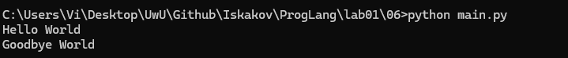

Запустить не выйдет, если код в этом файле сломан

```py
def message(s):
    pint(s)
```

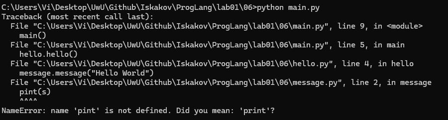

### Задание 7
*Запишите makefile для сборки программы на С++ из задания на раздельную трансляцию.*

*Обратите внимание, что целью выполнения задания является не написание собственно makefile, а изучение зависимостей в единицах трансляции в написанных программах
утилита* **make** *имеет достаточно удобные средства для автоматического поиска зависимостей, но в данном случае пользоваться ими нельзя. Весь файл должен быть записан
только с использованием базового синтаксиса* 

```
цель : зависимости
    команда
```

* Выполните сборку программы из объектных файлов и проверьте ее работоспособность.
* Проверьте какие команды из makefile выполняются при изменении каждого из исходных файлов.
* Проверьте, что произойдет при сборке, если один из объектных или исполняемых файлов будет потерян.
* Для проверки правильности указания зависимостей измените прототип функции **message** на
```
void message(char* mes);
```
* Выполните сборку проекта и проверьте работоспособность программы.


*В отчет вставьте пояснения о работе make и скриншоты работы в командной строке.*

*Сам makefile также надо сохранить в папке 04*

Создадим файл Makefile

```makefile
main.exe: message.o hello.o goodbye.o main.o
	g++ -o main.exe message.o hello.o goodbye.o main.o

message.o: message.cpp message.h
	g++ -c message.cpp

hello.o: hello.cpp hello.h message.h
	g++ -c hello.cpp

goodbye.o: goodbye.cpp goodbye.h message.h
	g++ -c goodbye.cpp

main.o: main.cpp hello.h goodbye.h
	g++ -c main.cpp
```

Сборка и запуск через mingw32-make

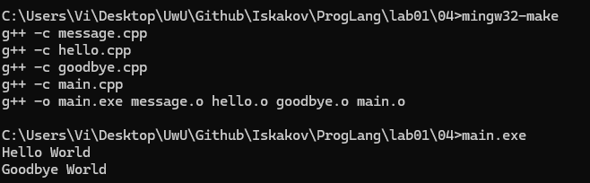

При изменении файла message.cpp Makefile собирает только то, что было изменено. Он отслеживает изменения в файлах по дате изменения. Другие файлы он не собирает заново, так как они не зависят от message.cpp

```cpp
#include "message.h"
#include <iostream>
#include <string>

// Добавлено

void message(std::string s) {
    std::cout << s << std::endl;
}
```

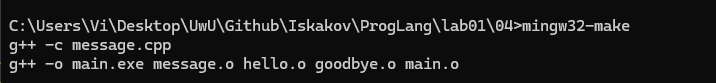

Но при изменении message.h Makefile собирает заново все файлы, которые от него зависят

```h
#include <string>

// Добавлено

void message(std::string s);
```

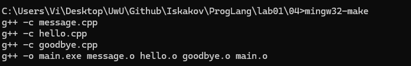

После удаления hello.o, message.o, main.exe Makefile замечает отсутствие этих файлов и собирает их все заново. Это видно по отсутствию команды g++ -c goodbye.cpp, так как его файлы не были удалены

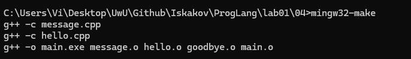

При изменении прототипа функции из message.cpp, message.h (заодно доработаем hello.cpp, goodbye.cpp) Makefile заново соберет программу, потому что hello.cpp, goodbye.cpp зависят от message.cpp

message.cpp

```cpp
#include "message.h"
#include <iostream>
#include <string>

void message(char* mes) {
    std::cout << mes << std::endl;
}
```

message.h 

```h
#include <string>

void message(char* mes);
```

hello.cpp

```cpp
#include "hello.h"
#include "message.h"

void hello() {
    char mes[] = "Hello World";
    message(mes);
}
```

goodbye.cpp

```cpp
#include "goodbye.h"
#include "message.h"

void goodbye() {
    char mes[] = "Goodbye World";
    message(mes);
}
```

Компилируем и запустим после всех изменений

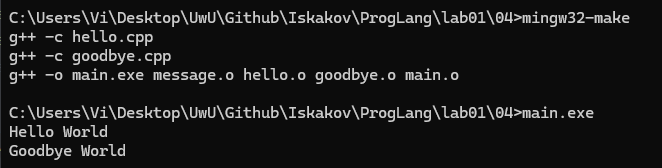

### Задание 8
*Проверьте различные синтаксические конструкции языка С++. Каждая из них появилась в определенном
стандарте С++. Попытайтесь выполнить трансляцию каждого файла и выясните в стандарте каких годов
были реализованы эти конструкции. Следует проверить стандарты 1998, 2003, 2011, 2014 и 2017 годов.*

#### 1. Использование вектора
```
#include <vector>
#include <iostream>
int main() {
   std::vector<int> v(5);
   for (int i=0;i<5;i++)
       std::cout << v[i]<<' ';
   return 0;
}
```
#### 2. Цикл по коллекции.
*Замените цикл для вывода вектора*
```
   for (int x:v)
       std::cout << x << ' ';
```
#### 3. Вывод типа по инициализатору
*В цикле по коллекции используйте автоматический вывод типа для переменной x, используя ключевое слово* **auto**.

#### 4. Инициализация списком
*Добавьте в строку создания вектора инициализацию списком.*
```
   std::vector<int> v = {1, 2, 3, 4, 5};
```

#### 5. Сепараторы для групп разрядов.
*Добавьте в список инициализации длинное число с сепараторами для групп разрядов.*
```
   std::vector<int> v = {1, 2, 3, 4, 5, 1'000'000'000};
```

#### 6. Вывод типа по конструктору. 
*Уберите из строки создания вектора его тип.*
```
   std::vector v = {1, 2, 3, 4, 5};
```

*В отчет вставьте пояснения о стандартах С++ и используемых возможностях языка*.

*Все примеры программ надо сохранить в папке 08*

Создадим файл 01.cpp

```cpp
#include <vector>
#include <iostream>
int main() {
   std::vector<int> v(5);
   for (int i=0;i<5;i++)
       std::cout << v[i]<<' ';
   return 0;
}
```

Компиляция в стандарте 98 прошла успешно, так как код содержит только базовые возможности языка

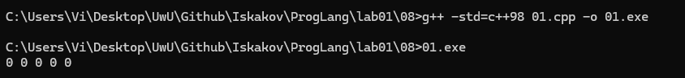

Создадим файл 02.cpp

```cpp
#include <vector>
#include <iostream>
int main() {
   std::vector<int> v(5);
   for (int x:v)
       std::cout << x << ' ';
   return 0;
}
```

Компиляция может быть выполнена только в стандарте 2011, как и говорит ошибка в консоли

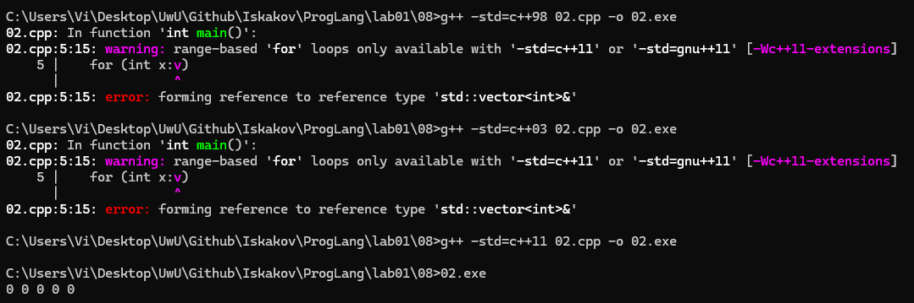

Создадим файл 03.cpp

```cpp
#include <vector>
#include <iostream>
int main() {
   std::vector<int> v(5);
   for (auto x:v)
       std::cout << x << ' ';
   return 0;
}
```

Компиляция в стандарте 98 провалилась. Ошибка 'x does not name a type' - переменная x не объявляет тип.

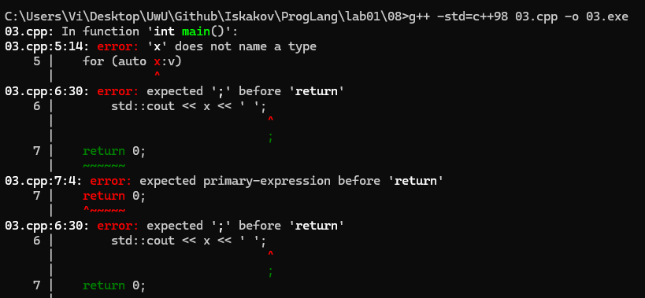

Компиляция возможна только в стандарте 2011

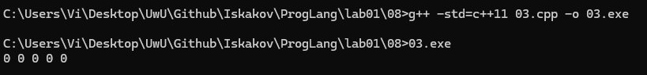

Создадим файл 04.cpp

```cpp
#include <vector>
#include <iostream>
int main()
{
    std::vector<int> v = {1, 2, 3, 4, 5};
    for (auto x : v)
        std::cout << x << ' ';
    return 0;
}
```

Компиляция в стандарте 98 не выполнена. Ошибка 'v must be initialized by constructor' - вектор v должен быть объявлен с помощью конструктора.

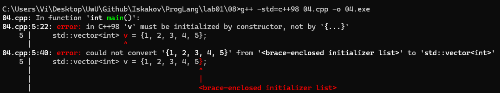

Компиляция в стандарте 2011 возможна

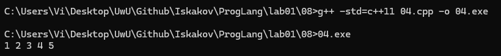

Создадим файл 05.cpp

```cpp
#include <vector>
#include <iostream>
int main()
{
    std::vector<int> v = {1, 2, 3, 4, 5, 1'000'000'000};
    for (auto x : v)
        std::cout << x << ' ';
    return 0;
}
```

Компиляция в стандарте 98 жалуется на то, что не может правильно распознать запись 1'000'000'000, из-за чего выкидывает самые разные ошибки. 

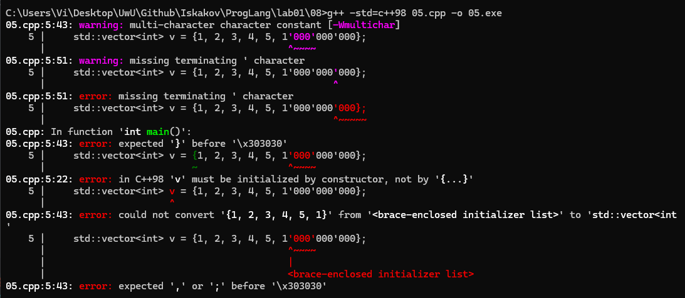

В этот раз пришлось взять стандарт 2014 чтобы Компиляция прошла успешно

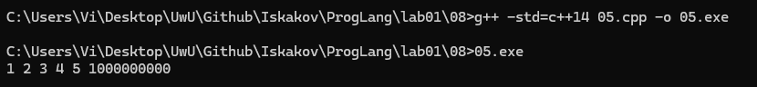

Создадим файл 06.cpp
```cpp
#include <vector>
#include <iostream>
int main()
{
    std::vector v = {1, 2, 3, 4, 5};
    for (auto x : v)
        std::cout << x << ' ';
    return 0;
}
```

Логично, что в стандарте 98 будет жаловаться на то, что пропущен аргумент литерала (missing template arguments) перед v. В стандарте 2014 та же история.

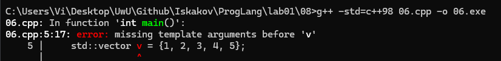

Повышаем стандарт до 2017 и компиляция проходит успешно

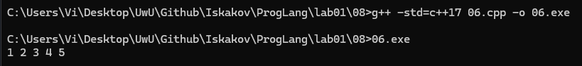

### Задание 9 **(3)**

*Запишите следующую программу на языке С++ и выполните ее трансляцию в 
асемблерные файлы с уровнями оптимизации* **O0**, **O1**, **O2**.
```
#include <iostream>
int main() {
   int x, s = 0;
   std::cin >> x;
   for (int i=0; i<123; i++) 
      s += x ;
   std::cout << s;
   return 0;
}
```
*Сохраните эти файлы и сравните код для функции main. Он начинается с декларации* **main:**. Сравните, как будет работать код программы
с разными уровнями оптимизации.*

*В отчет запишите различающиеся фрагменты ассемблерного кода с поясненими.*

Создадим файл main.cpp
```cpp
#include <iostream>
int main() {
   int x, s = 0;
   std::cin >> x;
   for (int i=0; i<123; i++) 
      s += x ;
   std::cout << s;
   return 0;
}
```

Выполним компиляцию с уровнями оптимизации O0, O1, O2 и посмотрим на различия в коде ассемблера

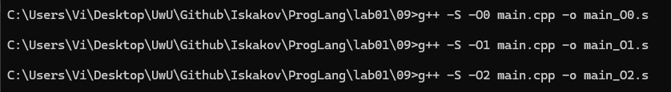

Посмотрим на код в main_O0.s
```s
movl $0, -8(%rbp)        # i = 0
jmp .L2                  # переход к проверке условия
.L3:
movl -12(%rbp), %eax     # взять x
addl %eax, -4(%rbp)      # s += x
addl $1, -8(%rbp)        # i++
.L2:
cmpl $122, -8(%rbp)      # если i <= 122
jle .L3                  # повторить цикл
```

Компилятор просто переводит код в ассемблер без дополнительных действий. Создает переменные x и s в памяти, делает честный цикл с проверкой условия 123 раза. На каждой итерации загружает x из памяти, прибавляет к s, увеличивает счетчик i, проверяет i < 123. 

Посмотрим на код в main_O1.s
```s
movl $123, %eax
.L2:
subl $1, %eax            # какая-то непонятная операция. к делу отношения вроде не имеет
jne .L2
imull $123, %edx, %edx   # edx = edx * 123 (то есть x * 123)
```

Компилятор теперь делает свою математику: он понял, что можно и не прибавлять 123 раза одно и то же число. Вместо цикла он делает s = x * 123. 

Посмотрим на код в main_O2.s
```s
call _ZNSirsERi             # cin >> x
imull $123, 44(%rsp), %edx  # edx = x * 123
call _ZNSolsEi              # cout << s
xorl %eax, %eax             
```

Цикл полностью исчез. Компилятор сразу после чтения x делает умножение x * 123 и выводит результат.