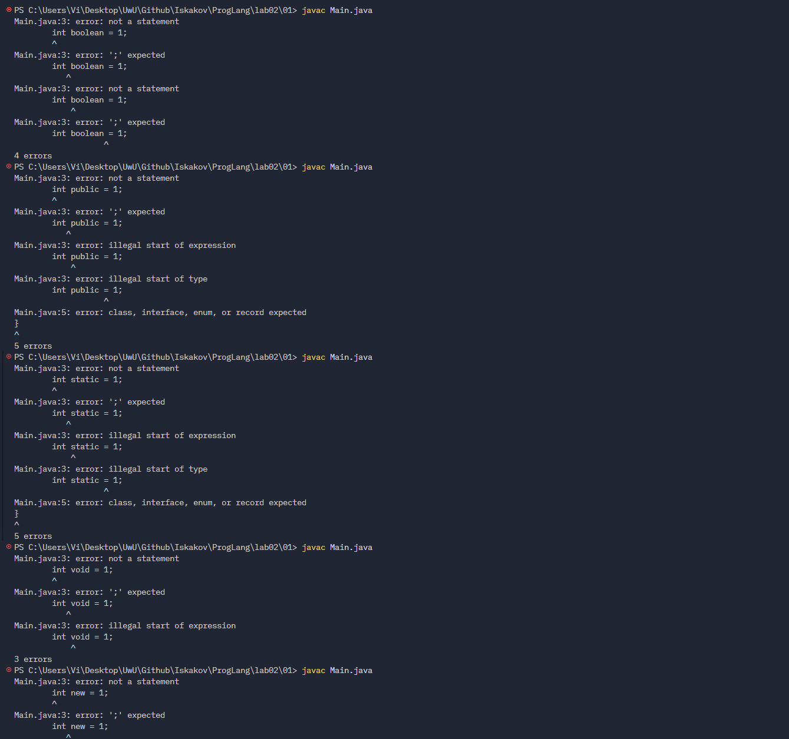
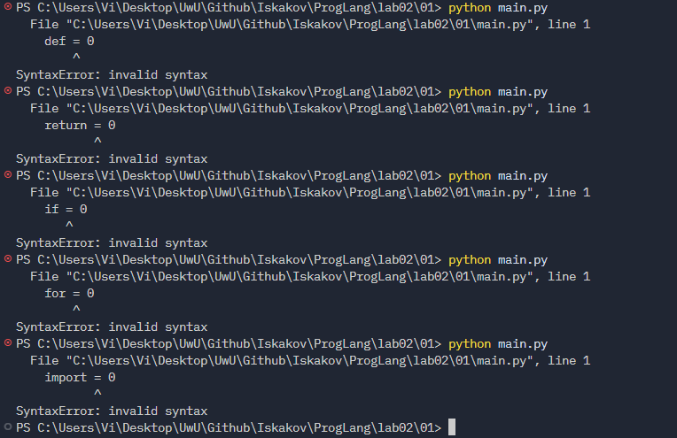
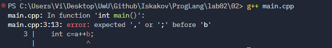
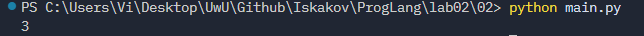
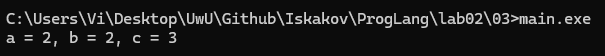
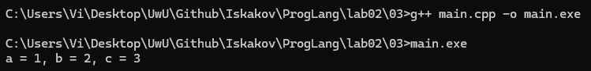
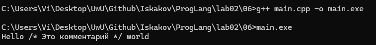
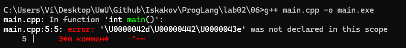
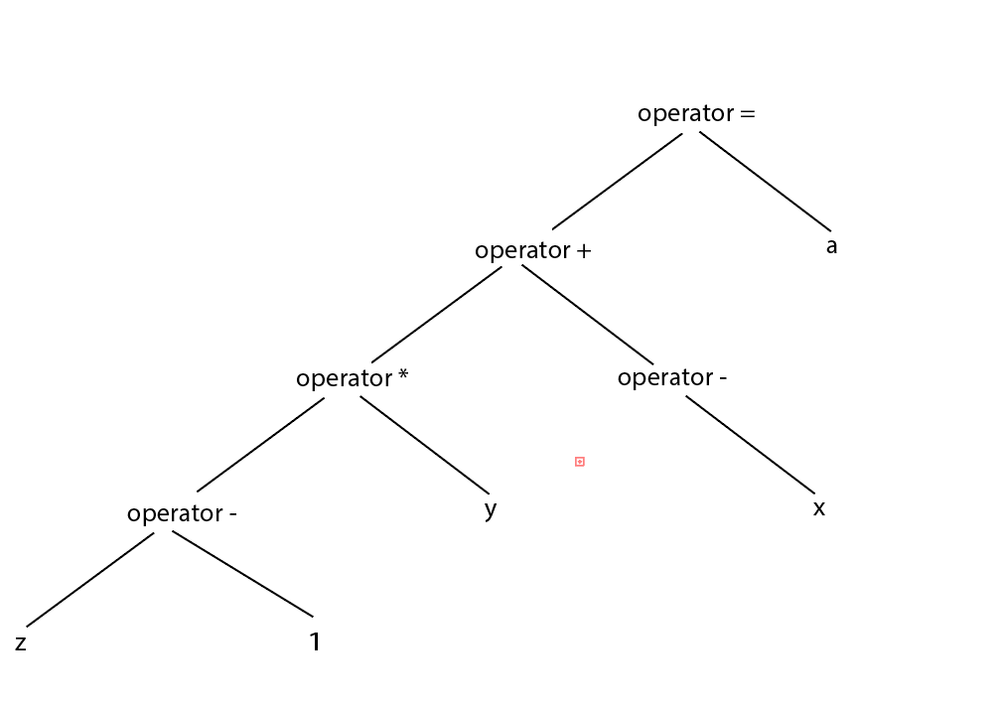

# Языки программирования

## Лабораторная работа 2

### Задание 1

Проверим возможность создания переменных с именами ключевых слов. Во всех трех языках это приводит к ошибке компиляции/интерпретации (SyntaxError или expected identifier), так как эти слова зарезервированы синтаксисом.

- C++:`int`, `float`, `bool`, `void`, `signed`
- Java: `public`, `static`, `void`, `new`, `boolean`
- Python: `def`, `return`, `if`, `for`, `import`


Ошибка: `multiple types in one declaration` - сразу объявил более одного типа. Другая ошибка `declaration does not declare anything` говорит о том, что я вообще ничего не объявил. 



Ошибка: `not a statement` - не понимает, что я хочу создать



Ошибка: `invalid syntax` - Python просто пишет о неправильном синтаксисе

### Задание 2

Создадим файл main.cpp
```cpp
int main() {
   int a=1, b=2;
   int c=a++b;
   return 0;  
}
```

Запустим его



Ошибка: expected ',' or ';' before 'b'    

В C++ работает правило "максимального совпадения". Токенизатор жадно собирает максимально длинный допустимый токен. Он видит `a++` как один токен (оператор постфиксного инкремента). Далее идет `b`. Получается конструкция `(a++) b`, которая синтаксически неверна, так как после выражения `a++` ожидается оператор или точка с запятой, а не просто идентификатор.

Создадим файл main.py
```py
a=1
b=2
c=a++b
```

Запустим его



Запуск прошел успешно и c = 3

В Python оператора `++` не существует. Поэтому токенизатор разбивает строку `a++b` на четыре отдельных токена: `a`, `+`, `+`, `b`. Это интерпретируется как `a + (+b)`, то есть `1 + 2 = 3`, поэтому ошибки и нет.

### Задание 3

Создадим файл main.cpp
```cpp
#include <iostream>

int main() {
   int a=1, b=2;
   int c=a+++b;

   std::cout << "a = " << a << ", " << "b = " << b << ", " << "c = " << c << std::endl;
   
   return 0; 
}
```

Запустим его



Сработало правило максимального совпадения. Токенизатор разбил `a+++b` на токены: `a`, `++`, `+`, `b`. Это читается как `(a++) + b`. Сначала берется значение a (1), прибавляется b (2), результат 3 записывается в c. Затем a инкрементируется до 2.

Изменим файл main.cpp
```cpp
#include <iostream>

int main() {
   int a=1, b=2;
   int c=a+ + +b;

   std::cout << "a = " << a << ", " << "b = " << b << ", " << "c = " << c << std::endl;
   
   return 0; 
}
```

Запустим



Если изменить код на `int c = a+ + +b;` (добавив пробелы), nокенизатор разобьет эту строку на 5 отдельных токенов: `a`, `+`, `+`, `+`, `b`. 

Пробелы нарушают правило максимального совпадения. Компилятор интерпретирует это выражение как `a + (+ (+b))`, где первый `+` - бинарный оператор сложения, а второй и третий `+` - унарные плюсы, примененные к переменной `b`.

### Задание 4 

Круглые скобки `()` являются оператором в случае вызова функции или функционального объекта.
Пример оператора: вызов метода объекта `v.push_back(1)`, `my_func()` (вызов функции).
Пример не оператора: `if (a > b)` или `int x = (a + b);` (здесь скобки служат только для группировки и изменения приоритета вычислений).

Квадратные скобки `[]` являются оператором в случае обращения к элементу массива
Пример оператора: `int x = arr[0];`
Пример не оператора: `auto comparator = [](int a, int b) { return a < b; };` квадратные скобки [] являются частью синтаксиса объявления функции (списком захвата переменных), а не оператором. Они не выполняют никаких действий над данными, а лишь задают правила видимости внешних переменных для этой функции, аналогично тому, как круглые скобки () в объявлении void foo() задают список параметров, но не являются оператором вызова.

### Задание 5

Рассмотрим код
```py
print(*map(sum, zip(*[map(int, input().split()) for i in (1,2,3)])))
```

- Ключевые слова: `for`, `in`
- Переменные: `i`
- Идентификаторы (функции/методы): `print`, `map`, `sum`, `zip`, `input`, `split`, `int`
- Литералы: `1`, `2`, `3`
- Операторы: `*` (оператор распаковки), `.` (доступ к атрибуту/методу), `()` (оператор вызова функции), `[]` (создание списка).


Порядок действий и как выполняется:
1. `for i in (1,2,3)`: цикл выполняется 3 раза
2. `input().split()`: `input()` считывает строку и `split()` разбивает её на список строк по пробелам
3. `map(int, ...)`: применяет функцию `int` к каждому элементу списка 
4. `[...]`: формирует матрицу из трёх таких списков чисел 
5. `*` (перед списком): распаковывает список списков в отдельные аргументы для функции `zip`
6. `zip(...)`: транспонирует матрицу, группируя элементы по столбцам
7. `map(sum, ...)`: применяет функцию `sum` к каждому столбцу
8. `print(*)`: распаковывает результаты сумм и выводит их через пробел

Таким образом, программа считывает 3 строки чисел, разделенных пробелами, и выводит сумму чисел в каждом столбце.

### Задание 6

Создадим файл main.cpp и попробуем комментарии по-разному

1. 
```cpp
#include <iostream>

int main() {
    std::cout << "Hello /* Это комментарий */ world";

    return 0;
}
```

Токенизатор встречает открывающую кавычку ". С этого момента и до следующей закрывающей кавычки всё содержимое считается строковым литералом. Символы /* и */ внутри кавычек теряют свое специальное значение и воспринимаются просто как обычный текст.



2. 
```cpp
#include <iostream>

int main() {
    // /*
    Это комментарий
    */

    return 0;
}
```



Ошибка: '\U0000042d\U00000442\U0000043e was not declared in this scope'

Токенизатор встречает // и переходит в режим однострочного комментария. Он игнорирует всё до конца первой строки. На второй строке он видит текст 'Это' (просто в консоли оно вывелось как кодировка символов) комментарий вне какого-либо комментария. Токенизатор пытается прочитать это как код C++, но слово "Это" не является допустимой командой или объявленной переменной, поэтому выдает ошибку was not declared in this scope. 

3. 
```cpp
#include <iostream>

int main() {
    /* Я комментирую программы /* комментарий */ */

    return 0;
}
```

Ошибка: expected primary-expression before '/' token и expected primary-expression before 'return'

Токенизатор встречает первый /* и переходит в режим блочного комментария. Он жадно читает всё подряд до первого же встреченного */.
Токенизатор поглощает вот этот кусок: `/* Я комментирую программы /* комментарий */`. После этого комментарий закрывается. Оставшаяся часть строки */ оказывается вне комментария. Токенизатор видит одинокие символы * и /, которые не образуют валидного синтаксиса C++, и выдает ошибку expected primary-expression before '/' token.

4. 
```cpp
#include <iostream>

int main() {
    // Я комментирую программы /* комментарий */  

    return 0;
}
```

Здесь ошибок нет и программа запускается

5. 
```cpp
#include <iostream>

int main() {
    /* Я комментирую свои программы
    // Это комментарий до конца строки */
    */  

    return 0;
}
```

Ошибка: expected primary-expression before '/' token и expected primary-expression before 'return'

Токенизатор встречает первый /* и начинает блочный комментарий. Он игнорирует всё, включая перенос строки и символы //, пока не найдет первый */.
После этого комментарий закрывается. На последней строке остается одинокий */. Как и в примере 3, токенизатор не понимает, что делать с этими символами вне комментария, и выдает синтаксическую ошибку.

### Задание 7

Рассмотрим стандарт С++, приложение 9.5 для инструкций циклов iteration-statement.

Как видно из правил, есть 4 инструкции циклов.

1. Первый вид - `while`, который сответсвует строке правила `while ( condition ) statement`
Формат записи: ключевое слово `while`, в круглых скобках условие `<condition>`, далее инструкция `<statement>`

Пример фрагмента программы:
```cpp
int x = 1;

while (x<1000) {
  cout << x;
  x *= 2;
}
``` 

2. Второй вид - `do while`, который сответсвует строке правила `do statement while ( expression )`
Формат записи: ключевое слово `do`, далее инструкция `<statement>`, затем ключевое слово `while`, в круглых скобках выражение `<expression>`

Пример фрагмента программы:
```cpp
int x = 1;

do {
    cout << x;
    x *= 2;
} while (x < 1000);
```

3. Третий вид - `for`,  который сответсвует строке правила `for ( for-init-statement conditionopt ; expressionopt ) statement`
Формат записи: ключевое слово `for`, в круглых скобках: инициализация `<for-init-statement>`, необязательное условие `<condition>`, точка с запятой, необязательное выражение инкремента `<expression>`, далее инструкция `<statement>`.

Пример фрагмента программы:
```cpp
for (int i = 0; i < 5; i++) {
    cout << i;
}
```

4. Четвёртый вид - `for`, который сответсвует строке правила `for ( for-range-declaration : for-range-initializer ) statement`
Формат записи: ключевое слово `for`, в круглых скобках: объявление переменной `<for-range-declaration>`, двоеточие, инициализатор диапазона `<for-range-initializer>`, далее инструкция `<statement>`.

Пример фрагмента программы:
```cpp
std::vector<int> v = {1, 2, 3};

for (int x : v) {
    cout << x;
}
```

### Задание 8

Создадим файл main.cpp
```cpp
int main() {
    int a,x,y,z;
    cin >> x >> y >> z;
    a = -x + y * (z - 1);
}
```

Построим абстрактное синтаксическое дерево для выражения `a = -x + y * (z - 1)`


