# Языки программирования
## Лабораторная работа 3

### Задание 1 **(3)**
*Составьте глоссарий из определений лекции. Проверка отчета будет включать 
проверку знания определений*
* **Тип в программировании** — атрибут объекта данных, задающий множество допустимых значений и методы для работы с ними.
* **Статическая типизация** — тип объекта данных определяется в момент трансляции.
* **Динамическая типизация** — если тип объекта данных определяется на этапе выполнения программы в момент создания или присваивания значения
* **Неявная типизация** — тип определяется автоматически по тексту программы
* **Явное преобразование типа** — тип указан в программе в виде вызова функции или в виде операции.
* **Неявное преобразование типа** — тип не присутствует в программе в виде конкретного указания, однако транслятор сам подставляет требуемый метод преобразования.
* **Сильная типизация** — язык программирования не содержит (почти не содержит) правил неявного преобразования типа.
* **Слабая типизация** — язык программирования содержит большое число правил неявного преобразования типа, допускает каламбуры типизации.

### Задание 2 **(3)**
*Запишите правила неявного преобразования типов в языке С++*

*Проверка отчета будет включать проверку знания правил.*

*Преобразования при присваивании*

*Преобразования при арифметических действиях*

*Преобразования с логическими значениями*

Правила неявного преобразования типов в языке С++

**Преобразования с логическими значениями**
1. Преобразование в bool: 0 — false; остальные значения — true.
2. Преобразование из bool: false — 0; true — 1.

**Преобразования при арифметических действиях**
1. Если длины обоих типов меньше int то преобразование к int.
2. Если типы разной длины, то преобразуется меньший к большему
3. Если типы равной длины и один знаковый, а другой беззнаковый, то знаковый приводится к беззнаковому.
4. Если один целый, а другой вещественный, то целый приводится к вещественному.

**Преобразования при присваивании**
1. При присваивании значение правого операнда приводится к типу левого операнда.

### Задание 3 **(2)**

*Языки C++ и Java имеют похожий синтаксис, однако
язык С++ относят к языкам со слабой статической типизацией, а Java - с сильной статической типизацией.
Приведите примеры, показывающие это различие. Для этого вам надо подобрать несколько близких по смыслу фрагментов программ,
которые будут транслироваться в С++, но вызывать ошибку согласования типов в Java.*

*Записанные программы сохраните в папке с номером задания. В отчет запишите пояснения к работе программ.*

1. Пример того, как C++ и Java работают с неявным логическим значением (1 вместо True).

Создадим файл main.cpp
```cpp
#include <iostream>

int main() {
    int isValid = 1;

    if (isValid) {
        std::cout << "Correct!" << std::endl;
    }
}
```

Компиляция и запуск успешны. С++ неявно преобразовал число 1 в логический тип (true).

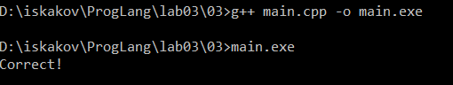

Теперь создадим файл Main.java с такими же инструкциями
```java
public class Main {
    public static void main(String[] args) {
        int isValid = 1;

        if (isValid) {
            System.out.println("Correct!");
        }
    }
}
```

Компиляция не прошла. Ошибка: 'incompatible types: int cannot be converted to boolean'. Java не преобразует число (1) в логическое значение, как это делает С++. 

2. Пример того, как С++ и Java работают с арифметическими операциями, в которых есть неявное преобразование типа

Создадим файл main2.cpp
```cpp
#include <iostream>

int main() {
    int a = 1;
    int b = 2;
    int c = 3;

    if ((a == b) + c) {
        std::cout << "OK" << std::endl;
    } else {
        std::cout << "NOT OK" << std::endl;
    }
}
```

Компилируем, запускаем и видим результат.

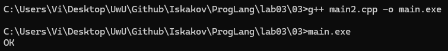

Ошибок нет. Почему так и что произошло? Во время проверки (a == b) + c, C++ выполняет следующие действия:
1. a == b даёт false
2. false + c преобразуется в 0 + 3
3. 0 + 3 даёт 3
4. 3 преобразуется в true
5. проверка проходит и результатом становится вывод "OK"

Создадим файл Main2.java
```java
public class Main {
    public static void Main(String[] args) {
        int a = 1;
        int b = 2;
        int c = 3;

        if ((a == b) + c) {
            System.out.println("OK");
        } else {
            System.out.println("NOT OK");
        }
    }
}
```

Компилируем и видим ошибку.

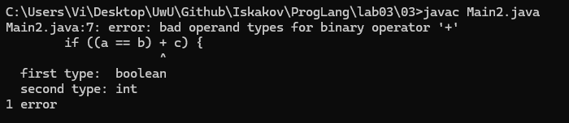

Java очень подробно описывает ошибку: `bad operand types for binary operator +, first type - boolean, second type - int.`
`bad operand types for binary operator +` означает, что для бинарного оператора `+` мы привели неверные операнды, первый из которых - логический (boolean), второй - целочисленный (int). Java их не преобразует к целочисленным и выдаёт ошибку.
1. a == b даёт false
2. false + c приводит к ошибке, т.к. Java не преобразует логический тип к целочисленному для выполнения данной операции

Эти два примера иллюстрируют причину, по которой C++ является слабо типизированным языком, а Java - языком с сильной типизацией.

### Задание 4 **(1)**

*Рассмотрите следующий фрагмент программы.*

```
bool x = true, y = false;
auto a = x & y;
std::cout << typeid(a).name() << std::endl;
auto b = x && y;
std::cout << typeid(b).name() << std::endl;
```
*Используя* **typeid**, *найдите типы переменных* **a** и **b**. *Объясните результат.*

*Записанную программу сохраните в папке с номером задания.*

Допишем данный код чтобы скомпилировать его и запустить
```cpp
#include <iostream>

int main()
{
    bool x = true, y = false;
    auto a = x & y;

    std::cout << "Тип a " << typeid(a).name() << std::endl;

    auto b = x && y;

    std::cout << "Тип b " << typeid(b).name() << std::endl;
}
```

Компилируем, запускаем и видим результат.

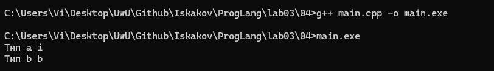

В результате видим, что тип a - i (int), тип b - b (bool). 
Объяснение:
Первая операция - побитовое И `&` преобразует `x` в `1` и `y` в `0`. Результат - 0 (int).
Вторая операция - логическое И `&&`, работает с типом boolean и не преобразует `x` и `y`, а true && false даёт false (boolean)

### Задание 5. **(2)**

*Приведите разумные (логичные) примеры использования в 
С++ ключевых слов* **typedef, auto, decltype, static_cast** и оператора **sizeof**.

*Записанные программы сохраните в папке с номером задания. В отчет запишите пояснения к программам*.

Создадим 5 файлов с использованием ключевых слов. Скриншотов для 01-04 не будет, так как проверять вывод тут не имеет большого смысла.

1. 01.cpp
```cpp
#include <iostream>
#include <vector>

typedef std::vector<int> Numbers;

int main() {
    Numbers my_numbers = {1, 2, 3};
    std::cout << my_numbers.size() << std::endl;
    return 0;
}
```

*Что делает код?* Создает что-то вроде своего сокращения `Numbers` для типа `std::vector<int>` и использует его для создания вектора чисел.
*Зачем?* Чтобы не писать каждый раз длинное `std::vector<int>`. Это делает код короче.

2. 02.cpp
```cpp
#include <iostream>
#include <vector>

int main() {
    std::vector<double> prices = {10.5, 20.1, 30.0};

    for (auto price : prices) {
        std::cout << price << " ";
    }
    
    std::cout << std::endl;

    return 0;
}
```

*Что делает код?* Проходит циклом по вектору дробных чисел, используя `auto` для переменной `price`.
*Зачем?* Компилятор сам понимает, что `price` должен быть типа `double`. Нам не нужно лишний раз смотреть, что за типы в векторе. Это особенно полезно, когда есть более сложные, менее читаемые конструкции типа вектор векторов.

3. 03.cpp
```cpp
#include <iostream>

float calc_avg(int a, int b) {
    return (a + b) / 2.0f;
}

int main() {
    decltype(calc_avg(10, 20)) res;

    res = calc_avg(10, 20);

    std::cout << res << std::endl;

    return 0;
}
```

*Что делает код?* Объявляет переменную `res` ровно того типа, который возвращает функция `calc_avg` (то есть `float`), а затем присваивает ей вычисленное значение.
*Зачем?* Позволяет спросить у компилятора: "Какой тип вернет это выражение?", и создать переменную именно этого типа. Это очень важно в шаблонном программировании, когда мы не знаем точный тип заранее.

4. 04.cpp
```cpp
#include <iostream>

int main() {
    int total = 9;
    int cnt = 2;

    double avg = static_cast<double>(total) / cnt;

    std::cout << avg << std::endl;

    return 0;
}
```

*Что делает код?* Делит целое число 9 на 2, но перед делением явно преобразует переменную `total` в тип `double`. Выводит корректный результат `4.5`.
*Зачем?* Без `static_cast` C++ выполнил бы целочисленное деление и выдал бы `4`. Явное преобразование одного из операндов гарантирует правильный математический результат с дробной частью.

5. 05.cpp
```cpp
#include <iostream>

struct Enemy {
    int id;
    char tier;
};

int main() {
    std::cout << sizeof(Enemy) << std::endl;

    return 0;
}
```

В этом случае важно запустить программу и увидеть неожиданный результат, так как по логике там должно быть 5 байт (int - 4 байт, char - 1 байт), а вывод показал 8. 

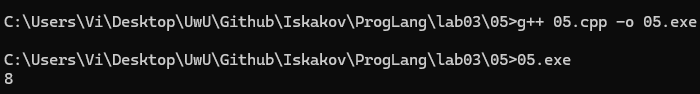

*Что делает код:* Выводит размер структуры `Enemy` в байтах.
*Зачем это нужно:* Позволяет узнать реальный размер данных в памяти. 

### Задание 6 **(2)**

Рассмотрите следующий фрагмент программы. 
```
int a = -1, b = 1;
unsigned int c = 1;
std::cout << a*b << std::endl;
std::cout << a*c << std::endl;
```
* *Объясните работу этой программы, используя правила неявного преобразования типов*
* *Что произойдет, если тип* **int** *заменить на* **short**, а **unsigned int** на **unsigned short**?*

Создадим файл 01.cpp
```cpp
#include <iostream>

int main()
{
    int a = -1, b = 1;
    unsigned int c = 1;
    
    std::cout << a * b << std::endl;
    std::cout << a * c << std::endl;

    return 0;
}
```

Компилируем, запускаем и проверяем результат

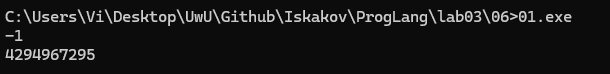

`std::cout << a * b << std::endl;` даёт -1, так как оба операнда типа int и преобразования типов не происходит.
`std::cout << a * c << std::endl;` даёт 4294967295, потому что размеры одинаковые, знаковый тип (int) преобразовался в беззнаковый (unsigned int), из-за чего второй принял максимальное значение 4294967295.

Заменим тип* **int** на **short**, а **unsigned int** на **unsigned short**?*
```cpp
#include <iostream>

int main()
{
    short a = -1, b = 1;
    unsigned short c = 1;
    
    std::cout << a * b << std::endl;
    std::cout << a * c << std::endl;

    return 0;
}
```

Компилируем, запускаем и проверяем результат

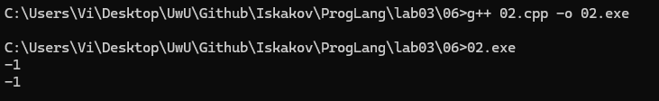

`std::cout << a * b << std::endl;` даёт -1, как и раньше.
`std::cout << a * c << std::endl;` даёт -1. Здесь ситуация иная: `short`, `unsigned short` преобразуются в `int`, -1 остаётся -1, 1 остаётся 1.

### Задание 7 **(2)**
*Рассмотрите следующий фрагмент программы.*
```
int x = 7, y = 4;
long double d = 0.25;
cout << (x / y) / d << endl;
cout << (x / d) / y << endl;
long a = 200000, b = 200000;
long long c = 200000;
std::cout << (a * b) * c << std::endl;
std::cout << a * (b * c) << std::endl;
```
*Почему изменения порядка действий приводит
к изменению результата? Объясните работу этой программы, используя правила неявного преобразования типов*

Создадим файл main.cpp
```cpp
#include <iostream>

int main()
{
    int x = 7, y = 4;
    long double d = 0.25;

    std::cout << (x / y) / d << std::endl;
    std::cout << (x / d) / y << std::endl;

    long a = 200000, b = 200000;
    long long c = 200000;
    
    std::cout << (a * b) * c << std::endl;
    std::cout << a * (b * c) << std::endl;

    return 0;
}
```

Компилируем, запускаем и проверяем результат

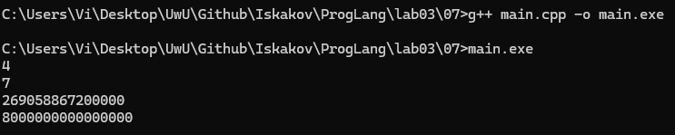

`std::cout << (x / y) / d << std::endl;`
1. Выполняется `x / y`, то есть `7 / 4`, где оба операнда имеют тип `int`, поэтому выполняется **целочисленное деление**, что приводит к отбрасыванию дробной части: `7 / 4 = 1`
2. Выполняется `1 / d`, то есть `1 / 0.25`, где один операнд `int` (1), другой `long double` (0.25), `int` преобразуется в `long double`, что приводит к `1.0 / 0.25 = 4.0`
3. Результат - `4`

`std::cout << (x / d) / y << std::endl;`
1. Выполняется `x / d`, то есть `7 / 0.25`, где один операнд `int` (7), другой `long double` (0.25) и `int` преобразуется в `long double`, что приводит к `7.0 / 0.25 = 28.0`
2. Выполняется `28.0 / y`, то есть `28.0 / 4`, один операнд `long double` (28.0), другой `int` (4) и снова `int` преобразуется в `long double`: `28.0 / 4.0 = 7.0`
3. Результат - `7`

Результаты разные потому что в первом случае целочисленное деление `7 / 4` происходит до преобразования в вещественный тип, и дробная часть теряется. А во втором случае деление на `0.25` происходит сразу с вещественными числами, поэтому дробная часть сохраняется.

**2. Переполнение при умножении:**

`std::cout << (a * b) * c << std::endl;`
1. Выполняется `a * b`, то есть `200000 * 200000`, где оба операнда имеют тип `long` (32 бит) и даёт `40000000000`, но это значение не помещается в 32-битный `long`, происходит переполнение
2. Некорректное значение после отбрасывания старших битов умножается на `c`, и результат остается ошибочным

`std::cout << a * (b * c) << std::endl;`
1. Сначала выполняется `b * c, где операнд `b` имеет тип `long` (32-битный), операнд `c` имеет тип `long long` (64-битный), а `b` преобразуется в `long long`. Так `200000 * 200000 = 40 000 000 000` происходит в 64 битах и переполнение не происходит.
2. Выполняется `a * (результат)`, где операнд `a` (тип `long`) преобразуется в `long long` и умножение происходит корректно
3. Результат - `8000000000000000`

### Задание 8 **(2)**

*Для каких значений целочисленных переменных* **x**, **y** ,**z** *результатом
вычисления следующего выражения будет истина? Перечислите* **все** *случаи.
Объясните работу этой программы, используя правила неявного преобразования типов*

```
(x == y) + (x == z) == true (два преобразования: + и ==)
```

Используем язык C++ для проверки неявного преобразования типов
Рассмотрим все случаи:

1. Создадим файл 01.cpp

```cpp
#include <iostream>

int main() {
    int x = 1;
    int y = 1;
    int z = 2;

    std::cout << ((x == y) + (x == z) == true) << std::endl;
}
```

Компилируем, запускаем и проверяем результат (верно)

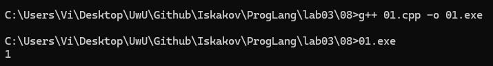

Поэтапно:
1. `x == y` даёт `true`
2. `x == z` даёт `false`
3. `true + false` преобразуется в `1 + 0` из-за неявного преобразования типа в операции арифметического сложения
4. 1 == true даёт `true` (1), т.к. `true` при сравнении с целым числом неявно преобразуется в `1`.

2. Создадим файл 02.cpp

```cpp
#include <iostream>

int main() {
    int x = 2;
    int y = 1;
    int z = 2;

    std::cout << ((x == y) + (x == z) == true) << std::endl;
}
```

Компилируем, запускаем и проверяем результат (верно)

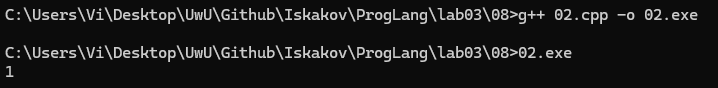

Поэтапно:
1. `x == y` даёт `false`
2. `x == z` даёт `true`
3. `false + true` преобразуется в `0 + 1` из-за неявного преобразования типа в операции арифметического сложения
4. 1 == true даёт `true` (1), т.к. `true` при сравнении с целым числом неявно преобразуется в `1`.

*Записанные программы сохраните в папке с номером задания.*

### Задание 9 **(2)**

*Проверьте работу логического выражения*
```
x==y==z
```
*в языках* **Python**, **Java**, **C++** *для
целочисленных переменных* **x**, **y**, **z**.
*Объясните результат для каждого из языков.*

1. Создадим файл main.cpp

```cpp
#include <iostream>

int main() {
    int x = 3;
    int y = 2;
    int z = 1;

    std::cout << (x == y == z) << std::endl;
}
```

Компилируем, запускаем и проверяем результат 

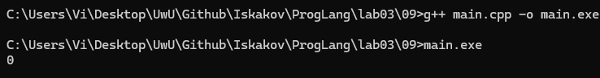

Объяснение: C++ — слабо типизированный язык. Вычисляем слева направо: `3 == 2` возвращает `false`, затем `false == 1`, что неявно преобразуется в `0 == 1` из-за правила неявного преобразования логического типа в int при сравнении, в итоге даёт `false` (0).

2. Создадим файл Main.java

```java
public class Main {
    public static void main(String[] args) {
        int x = 1;
        int y = 1;
        int z = 1;

        System.out.println(x == y == z);
    }
}
```

Компилируем, запускаем и видим ошибку

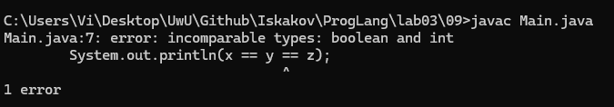

Ошибка: `incompatible types: boolean and int`. 
Объяснение: Java — сильно типизированный язык. `1 == 1` возвращает `true`, затем `true == 1` приведет к ошибке, упомянутой выше. Java не преобразует неявно тип `boolean` в тип `int`.

3. Создадим файл main.py

```py
x = 10
y = 10
z = 8

print(x == y == z)
```

Запускаем и проверяем результат

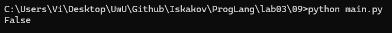

Объяснение: согласно официальной документации Python Language Reference (раздел 6.10. Comparisons):
> Comparisons can be chained arbitrarily, e.g., x < y <= z is equivalent to x < y and y <= z, except that y is evaluated only once.
Это означает, что выражение `x == y == z` трактуется как `(x == y) and (y == z)`, то есть `(10 == 10) and (10 == 8)`, что приводит к `True and False` и возвращает `False`.

*Записанную программу сохраните в папке с номером задания.*

### Задание 10 **(1)**

*Напишите программу на* **Python** *, демонстрирующую возможность неявного преобразования
строки в логическое значение.*

Создадим файл main.py

```py
s1 = "Hello"
s2 = ""

if s1:
    print("Не пустая строка!")
    
if not s2:
    print("Пустая строка!")
```

Запускаем и проверяем результат

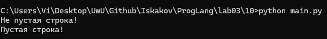

В Python при использовании строки в логическом контексте (например, в условии if как в коде) происходит неявное преобразование, где любая непустая строка считается `True`, а пустая строка `""` считается `False`.

*Записанную программу сохраните в папке с номером задания.*
