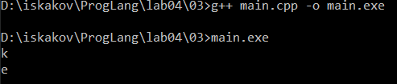
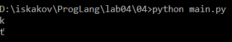
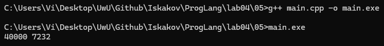
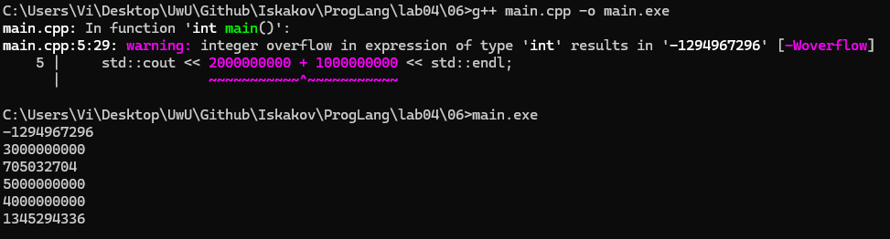
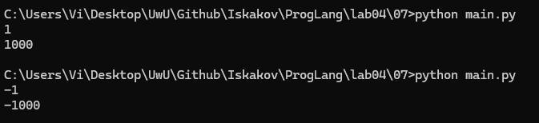
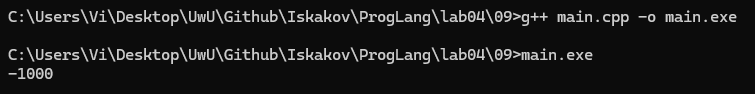

# Языки программирования
## Лабораторная работа 4

### Задание 1 **(3)**
* *Запишите двоичное представление числа -99 в целочисленном знаковом типе длиной 1, 2, 4 байта.* 
* *Запишите литералы равные наибольшему и наименьшему числу в типе* **int** *в шестнадцатеричной записи.*
* *Запишите двоичное представление символа "`#`" в типе* **char**.

99 = 0110 0011
~99 = 1001 1100
+1 -> 1001 1101

**-99 в двоичном виде:**
- 1 байт (знаковый char): `1001 1101` (дополнительный код: 256 - 99 = 157 = 1001 1101)
- 2 байта (знаковый short): `1111 1111 1001 1101` (расширение знака)
- 4 байта (знаковый int): `1111 1111 1111 1111 1111 1111 1001 1101`

**Литералы для int (4 байта):**
- Наибольшее: `0x7FFFFFFF` (2147483647)
- Наименьшее: `0x80000000` (-2147483648)

**Символ `#`:**
- Код символа: 35
- Двоичное представление: `00100011`

### Задание 2 **(3)**
*Напишите пример программы на С++ с использованием целочисленных литералов в разных форматах записи, 
разной длины, знаковых и беззнаковых. 
Пример должен охватывать большинство способов записи целочисленных литералов.*

Создадим файл main.cpp

```cpp
#include <iostream>

int main() {
    char a = 1; 
    int b = 010; 
    long c = 0b10100001; 
    long long d = 0x100011010101; 
    long long e = 0xA0ULL; 
    long f = 0xC01L; 
    int g = 2'000'000;

    return 0;
}
```

Рассмотрим форматы записи

- `char a = 1;` - десятеричная запись числа 1
- `int b = 010;` - восьмеричная запись числа 8
- `long c = 0b10100001;` - двоичная запись 161
- `long long d = 0x100011010101;` - шестнадцатиричная запись числа 17592471322881
- `long long e = 0xA0ULL;` - использование суффикса LL (long long), U (беззнаковый) числа 160
- `long f = 0xC01L;` - суффикс L (long), число 3073
- `int g = 2'000'000;` - разделение разрядов (C++ 14)


### Задание 3 **(2)**
*Объясните работу фрагмента программы на С++. В ходе объяснения следует использовать таблицу кодов символов.*
```
char a = 'a';
a = a + 10;
std::cout << a;
a = a + 250;
std::cout << a;
```

Создадим файл main.cpp
```cpp
#include <iostream>

int main()
{
    char a = 'a';
    a = a + 10;
    std::cout << a;
    a = a + 250;
    std::cout << a;

    return 0;
}
```

Компилируем, запускаем, проверяем результат



Объяснение первого вывода:
`char a` в C++ хранит код символа 'a' (97), и при арифметической операции `a + 10` происходит `97 + 10`. В результате переменная `a` принимает значение 107, что соответствует символу `k`

Объяснение второго вывода:
При операции `a + 250` получается 357 происходит переполнение типа `char`, отбрасываются старшие биты и остается число 101, что соответствует символу `e`

### Задание 4 **(2)**

*Перепишите программу из предыдущего задания на Python, используя функции* **chr** и **ord**.
*Почему ее вывод отличается от вывода программы на С++?*

Создадим файл main.py

```py
a = 'a'

a = ord(a) + 10;
print(chr(a))

a = a + 250
print(chr(a))
```

Запустим, посмотрим результат



В Python тип `int` имеет произвольную точность. Поэтому при `a + 250` получается 357, и `chr(357)` вернет символ с кодом 357 `ť`.

В C++ char занимает 8 бит, поэтому 357 не входит.

### Задание 5. **(2)**

*Объясните работу фрагмента программы на С++. В частности, почему* $x+x-x=x$, *но при этом*
$(x\cdot 2)/2\neq x$? *В отчете надо привести вычисления, приводящие к ответу.*
```
unsigned short x = 40000;
unsigned short y = x + x;
unsigned short z = x * 2;
y = y - x;
z = z / 2;
std::cout << y << " " << z << std::endl;
```

Создадим файл main.cpp

```cpp
#include <iostream>

int main()
{
    unsigned short x = 40000;
    unsigned short y = x + x;
    unsigned short z = x * 2;
    y = y - x;
    z = z / 2;
    
    std::cout << y << " " << z << std::endl;

    return 0;
}
```

Компилируем, запускаем, проверяем результат



**Объяснение результата y = 40000:**
1. `unsigned short` имеет размер 16 бит и хранит значения от 0 до 65535. Значение `x = 40000` помещается. 
2. В операции `x + x` происходит повышение `unsigned short` до `int`, и результатом становится 80000, но только в памяти.
3. `80000` превышает диапазон `unsigned short`, поэтому берется `80000 mod 65536`, что даёт `14464`
4. `y - x` опять повышает `unsigned short` до `int`, `14464 - 40000 = -25536`, но возвращение к `unsigned short` даёт `-25536 + 65536 = 40000`

**Объяснение результата z = 7232:**
1. В операции `x * 2` значение `x` повышается до `int`, и результатом становится 80000, но только в памяти.
2. `80000` превышает диапазон `unsigned short`, поэтому при записи в `z` берется `80000 mod 65536`, что даёт `14464`. Как и в случае с `y`, потеряно ровно одно `65536`.
3. `z / 2` повышает `unsigned short` до `int`, `14464 / 2 = 7232`. Это число помещается в `unsigned short`.
4. В отличие от вычитания в `y`, деление не возвращает потерянное `65536`. Если бы переполнения не было, то `80000 / 2 = 40000`. Но потерянное `65536` тоже делится пополам, и вместо него теряется `32768`: `40000 - 32768 = 7232`.

### Задание 6 **(2)**

*Объясните работу фрагмента программы на С++. Если имеет место переполнение, 
то требуется найти точный ответ до запуска программы, а только потом сверить его с выводом.
В отчете надо привести вычисления, приводящие к ответу.*
```
std::cout << 2000000000 + 1000000000 << std::endl;
std::cout << 2000000000U + 1000000000U << std::endl;
std::cout << 2500000000U + 2500000000U << std::endl;
std::cout << 2500000000LL + 2500000000LL << std::endl;
std::cout << 20000U * 200000U << std::endl;
std::cout << 200000U * 200000U << std::endl;
```

Создадим файл main.cpp

```cpp
#include <iostream>

int main()
{
    std::cout << 2000000000 + 1000000000 << std::endl;
    std::cout << 2000000000U + 1000000000U << std::endl;
    std::cout << 2500000000U + 2500000000U << std::endl;
    std::cout << 2500000000LL + 2500000000LL << std::endl;
    std::cout << 20000U * 200000U << std::endl;
    std::cout << 200000U * 200000U << std::endl;

    return 0;
}
```

Компилируем, запускаем, проверяем результат



Разберем все вычисления по порядку:

Запишем диапазоны типов для удобства:
**int**: −2 147 483 648 до 2 147 483 647
**unsigned int**: 0 до 4 294 967 295
**long long**: −9 223 372 036 854 775 808 до 9 223 372 036 854 775 807
**unsigned long long**: 0 до 18 446 744 073 709 551 615

Запишем суффиксы:
**U**: unsigned
**LL**: long long

**std::cout << 2000000000 + 1000000000 << std::endl;**:
Здесь тут сам компилятор говорит о переполнении. `2 000 000 000 + 1 000 000 000` приводит к переполнению, так как `3 000 000 000` больше макс. `int`. Вычитаем `4 294 967 296` из `3 000 000 000`, что и даёт результат `-1294967296`. 

**std::cout << 2000000000U + 1000000000U << std::endl;**:
Сложение даёт `3 000 000 000`, что меньше макс. значения `unsigned int`. Результат правильный. 

**std::cout << 2500000000U + 2500000000U << std::endl;**:
Сложение даёт `5 000 000 000`, что больше `unsigned int`, поэтому результатом будет `5 000 000 000` - `4 294 967 296` = `705032704`

**std::cout << 2500000000LL + 2500000000LL << std::endl;**:
Сложение `2 500 000 000 + 2 500 000 000` даёт `5 000 000 000`, что меньше макс. значения `long long`. Результат правильный.

**std::cout << 20000U * 200000U << std::endl;**:
Умножение `20000 * 200000` даёт `4 000 000 000`, что меньше макс. значения `unsigned int`. Результат правильный.

**std::cout << 200000U * 200000U << std::endl;**:
Умножение `200000 * 200000` даёт `40 000 000 000`, что уже больше макс. значения `unsigned int`. Вычитаем `4 294 967 296` * (`40 000 000 000` / `4 294 967 296`) из `40 000 000 000`, получаем `1345294336`.

### Задание 7 **(2)**

*Напишите программу на Python умножающую введенное число на 1000. В программе 
можно использовать только операторы сдвига и сложения. Циклы использовать нельзя. Из функций
можно использовать только* **input** *и* **print** *для ввода и вывода.*
```
x = int(input())
y = ...
print(y)
```

Создадим файл main.py
```py
x = int(input())
y = (x << 9) + (x << 8) + (x << 7) + (x << 6) + (x << 5) + (x << 3)
print(y)
```

Для начала объясним, что делает сдвиг. Выражение типа `x << k` умножает `x` на 2^k. Однако в нашей задаче умножить нужно на 1000, а 1000 не является степенью двойки. Нужно разложить 1000 на сумму степеней двойки:
1000 = 2^9 + 2^8 + 2^7 + 2^6 + 2^5 + 2^3

Далее нужно умножить `x` на каждую степень двойки и сложить.

Проверяем результат:



### Задание 8 **(2)**

*Найдите результаты вычисления следующих выражений без использования компьютера
или калькулятора. Процесс вычислений должен быть отображен в отчете.*
* `(1000 & 100) << 10`
* `(1000 >> 4) & 15`
* `~1234 + 1234`
* `(1000 ^ 500) & 63`
* `(100 << 3) + (100 >> 3)`

Сначала конвертируем числа в двоичное представление:
**1000** = 0000 0011 1110 1000

1000    2   0
500     2   0
250     2   0
125     2   1
62      2   0
31      2   1
15      2   1
7       2   1
3       2   1
1       2   1
0   

**500** = 0000 0001 1111 0100
500     2   0
250     2   0
125     2   1
62      2   0
31      2   1
15      2   1
7       2   1
3       2   1
1       2   1
0  

**100** = 0000 0000 0110 0100
100     2   0
50      2   0
25      2   1
12      2   0
6       2   0
3       2   1
1       2   1
0

**1234** = 0000 0100 1101 0010
1234    2   0
617     2   1
308     2   0
154     2   0
77      2   1
38      2   0
19      2   1
9       2   1
4       2   0
2       2   0
1       2   1
0

**63** = 0000 0000 0011 1111
63      2   1
31      2   1
15      2   1
7       2   1
3       2   1
1       2   1
0

**15** = 0000 0000 0000 1111
15      2   1
7       2   1
3       2   1
1       2   1
0

**(1000 & 100) << 10**
1111101000
&
0001100100
=
0001100000

0001100000 = 2^6 + 2^5 = 64 + 32 = 96
96 * 2^10 = 96 * 1024 = 98304

**(1000 >> 4) & 15**:
1000 >> 4 = 0000111110

0000 0000 0011 1110
&
0000 0000 0000 1111
=
0000 0000 0000 1110  

0000 0000 0000 1110 = 2^3 + 2^2 + 2 = 8 + 4 + 2 = 14

**~1234 + 1234**:

~1234 = 1111 1011 0010 1101

0000 0100 1101 0010
+
1111 1011 0010 1101
=
1111 1111 1111 1111

1111 1111 1111 1111 = -1

**(1000 ^ 500) & 63**:

0000 0011 1110 1000
^
0000 0001 1111 0100
=
0000 0010 0001 1100

0000 0010 0001 1100
&
0000 0000 0011 1111
=
0000 0000 0001 1100

0000 0000 0001 1100 = 2^4 + 2^3 + 2^2 = 16 + 8 + 4 = 28

**(100 << 3) + (100 >> 3)**
100 << 3 = 0000 0011 0010 0000
100 >> 3 = 0000 0000 0000 1100

0000 0011 0010 0000
+
0000 0000 0000 1100
=
0000 0011 0010 1100

0000 0011 0010 1100 = 2^9 + 2^8 + 2^5 + 2^3 + 2^2 = 512 + 256 + 32 + 8 + 4 = 812

###  Задание 9 **(2)**
*Напишите программу на языке С++ для умножения заданного целого числа на* $-1$. *В программе можно использовать только сложение и битовые
операции. Условия, циклы, библиотечные функции использовать нельзя.*

~n + n = -1
~n + 1 = -n

Создадим файл main.cpp
```cpp
#include <iostream>

int main() {
    int n = 1000;

    std::cout << (~n + 1) << std::endl;
}
```

Компилируем, запустим и проверим результат



## Дополнительные задания

### Задание 1 **(3)**

*Какие значения можно присвоить целочисленной переменной* **x**,
*чтобы результатом выражения `x|(x+1)` стало число 895?
Найдите все значения без использования компьютерных вычислений. 
Обоснуйте ответ.*

### Задание 2 **(3)**

*Какие значения можно присвоить целочисленной переменной* **x**,
*чтобы результатом выражения `x&(x-1)` стало число 0?
Найдите все значения без использования компьютерных вычислений 
(среди них есть отрицательные числа). Обоснуйте ответ.*

### Задание 3 **(3)**
*Какие значения можно присвоить целочисленной переменной* **x**,
*чтобы результатом выражения `x|(2*x)` стало число 1975?
Найдите все значения без использования компьютерных вычислений. 
Обоснуйте ответ.*

### Задание 4 **(3)**
*Обоснуйте корректность работы программы "Разложение числа по степеням двойки" из лекции.
Требуется определить, что будет результатом выражения `x&-x`.*

### Задание 5 **(5)**
*Ответьте на вопросы по программе "Упаковка коротких чисел" из лекции.*

* *Можно ли указанным способом сохранить более 8 чисел? Обоснуйте ответ.*
* *Сколько чисел можно будет сохранить при изменении диапазона от 0 до 7? Обоснуйте ответ.*
* *В чем смысл <<магической>> константы 15 в тексте программы?*
* *Если по условию задачи надо будет сохранить только числа в интервале от 0 до 10, то следует ли заменить
эту константу на 10? Обоснуйте ответ.*

### Задание 6 **(3)**
*Рассмотрим следующую программу на языке Python. Сколько чисел она выводит в зависимости от введенного
значения* **x**? *Как полученные числа зависят от* **x**?
```
x = int(input())
i = x
while i>0:
   print(i)
   i = (i-1) & x
```